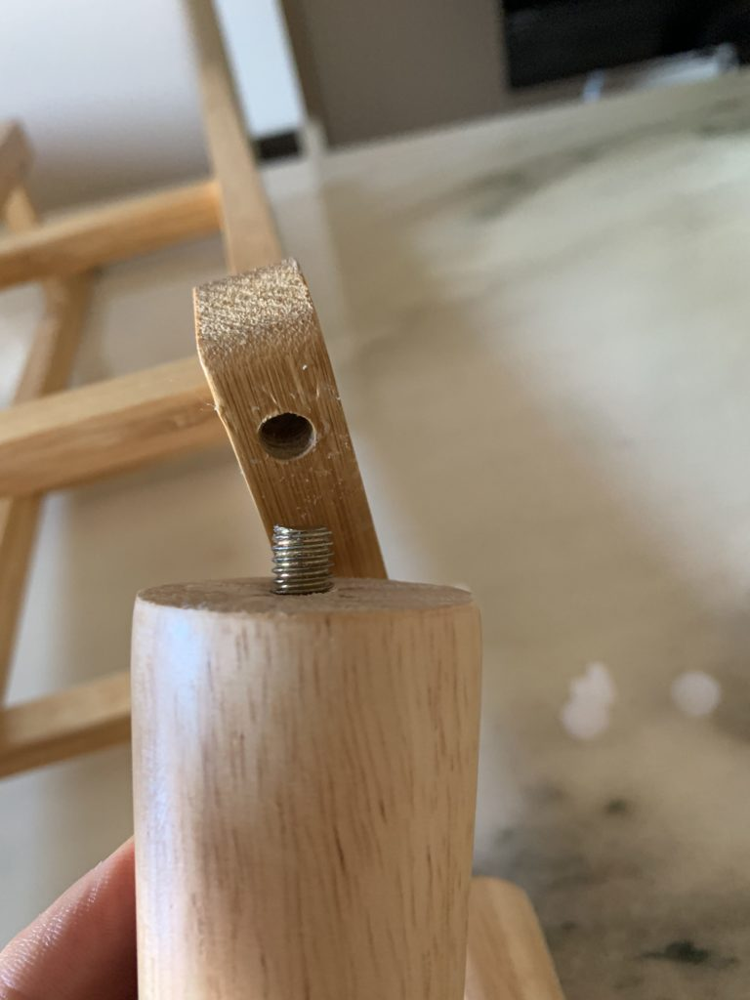
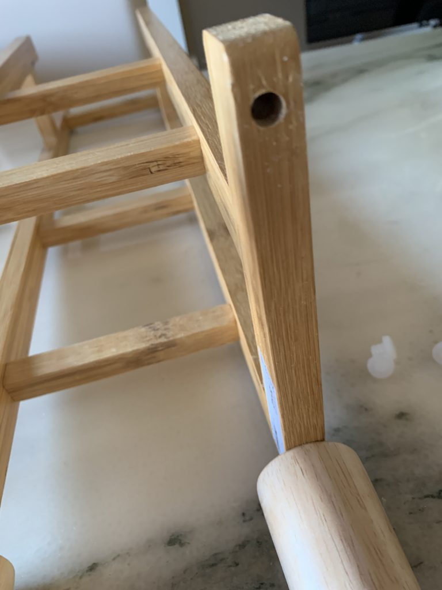
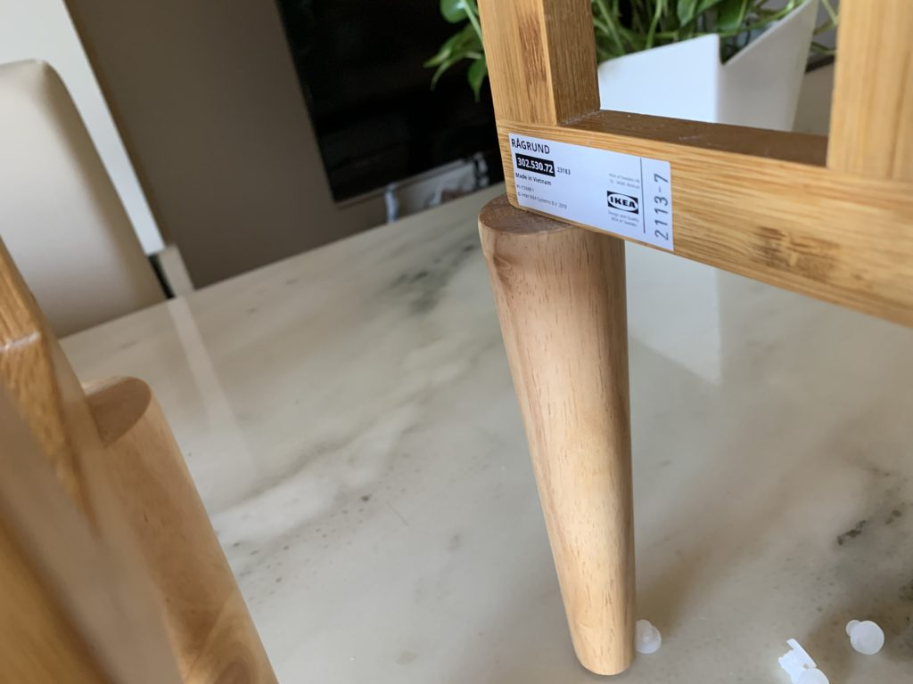
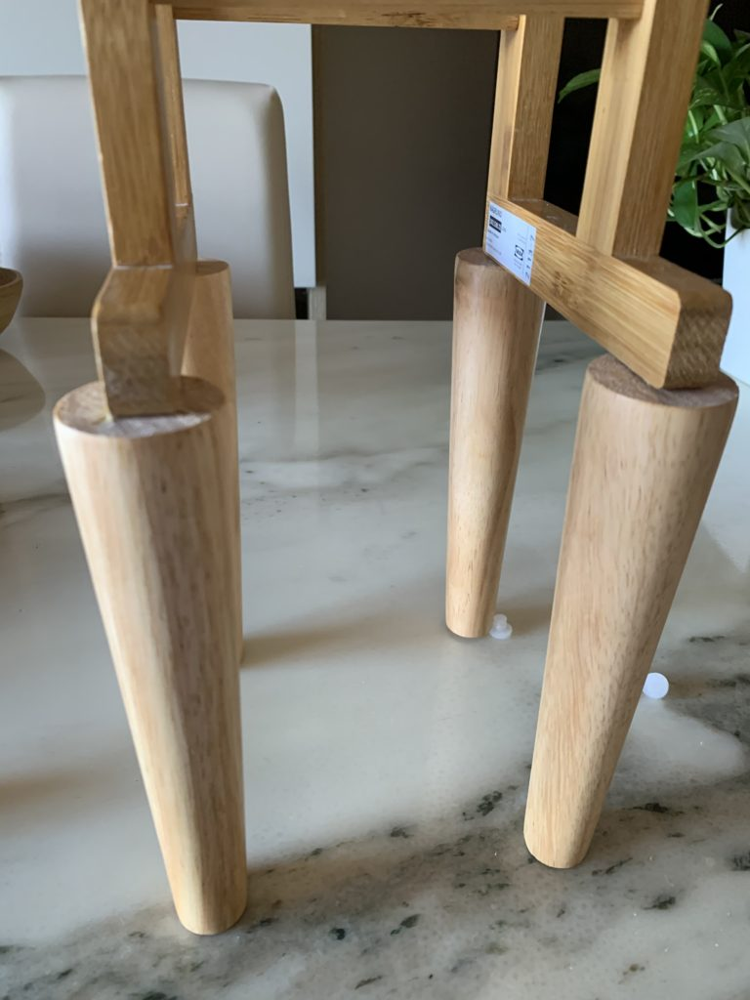
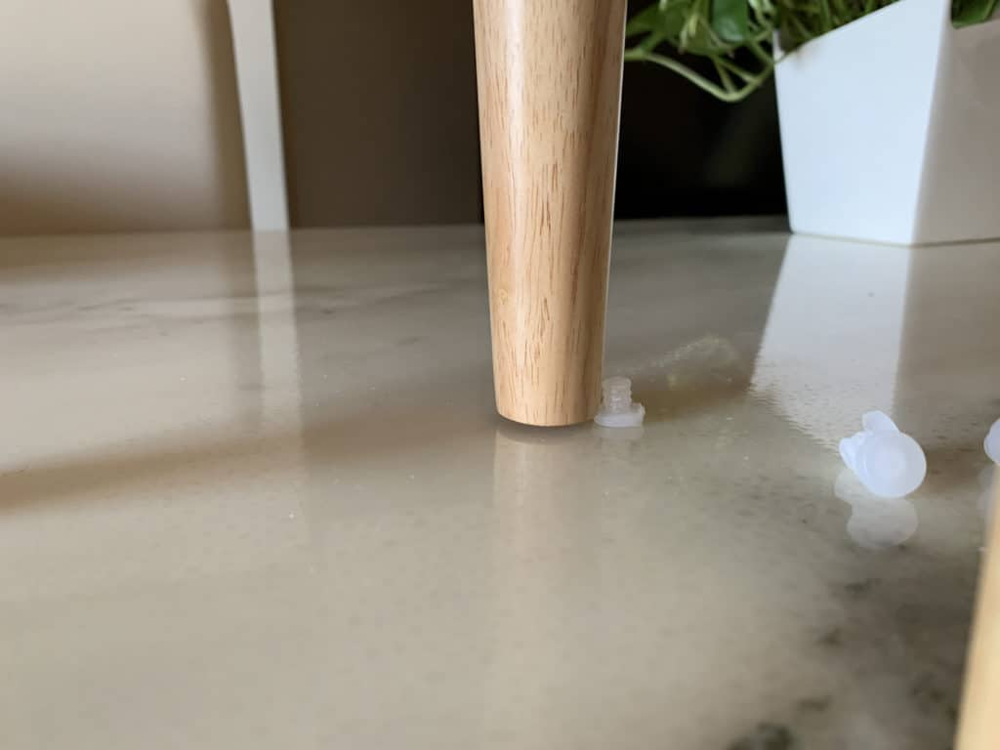
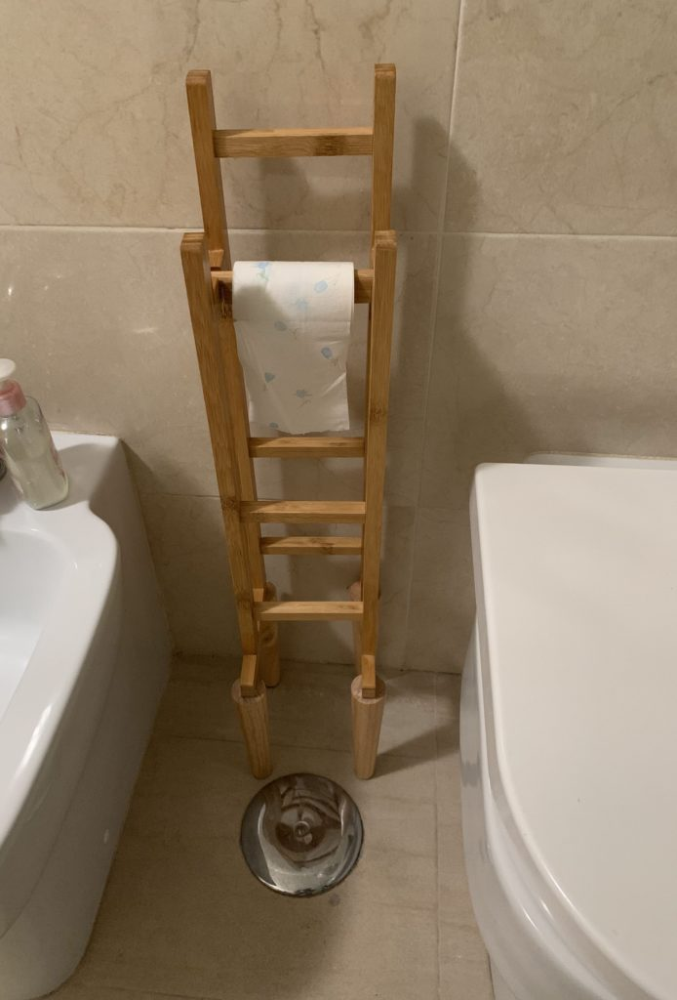

# Ikea Hack: The rise of the RÅGRUND toilet paper roll holder

### IKEA items used:

- [RÅGRUND](https://www.ikea.com/it/it/p/ragrund-porta-carta-igienica-bambu-30253072/)

### Other materials and tools: 

- [Solid natural wood legs for furniture 20cm tall](https://it.aliexpress.com/item/1005002120198601.html)

### Hack instructions:

I’m a tech addicted and electronic hobbyist, but this hack didn’t involved any futuristic technology.

I bought an Ikea toilet paper holder because my old one broken when fell from the wall and I choose the RÅGRUND for its wood look but after built following the instructions… I realized it’s very short (I want to use it from the floor) maybe in Sweden they put it on other furniture (idk).

Every time I need to reach the toilet paper I had to bend on my back to get what I need… seems near but it’s far down away when you can’t move or risk some back injuries (already hurting by working at desk entire day).

So I bought some (cheap) elegant natural wood feet for furniture matching the holder colors.

I reversed upside down the RÅGRUND and removed rubber feet revealing the holes

With my surprise (and luck) the hole matches perfectly the feet screws implanted in the wood. So I screwed the feet in place just by hand and hold tight so they don’t wobble.

- 
    
- 
    
- 
    

The furniture feet already had holes for rubber feet so I used the removed rubber feet from RÅGRUND reusing and dont’ waste plastic.

I placed in my bathroom and here is the result, everything is taller by 20cm. Easy to reach for ladies and gentlemen.

### How long and how much did it cost?

Less than 1 hour, the toilet paper holder costs 15€ + wood legs (13€)

### What do you like most about the hack?

It doesn’t need any electrical tools and doesn’t look hacked

### What was the hardest part about this hack?

Wait for delivery during lockdown :P

### What to pay special attention to?

Choose matching wood color when buy feet, anyway you can paint with your favorite color. I left natural wood.

### Disclaimer

Here just to share idea, all contributions are apprecieted on [github project issues](https://github.com/fabiosoft/ikeahack_ragrund_toilet_paper/issues).

Soon on [Ikeahackers](https://ikeahackers.net/) (hope), very inspiring community.
